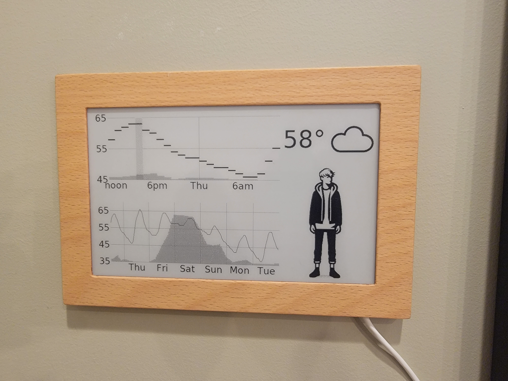
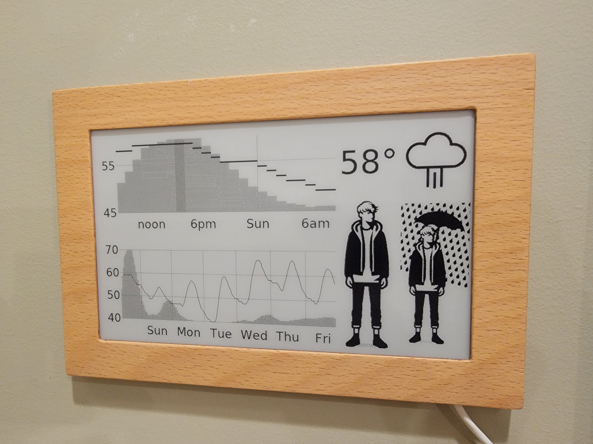
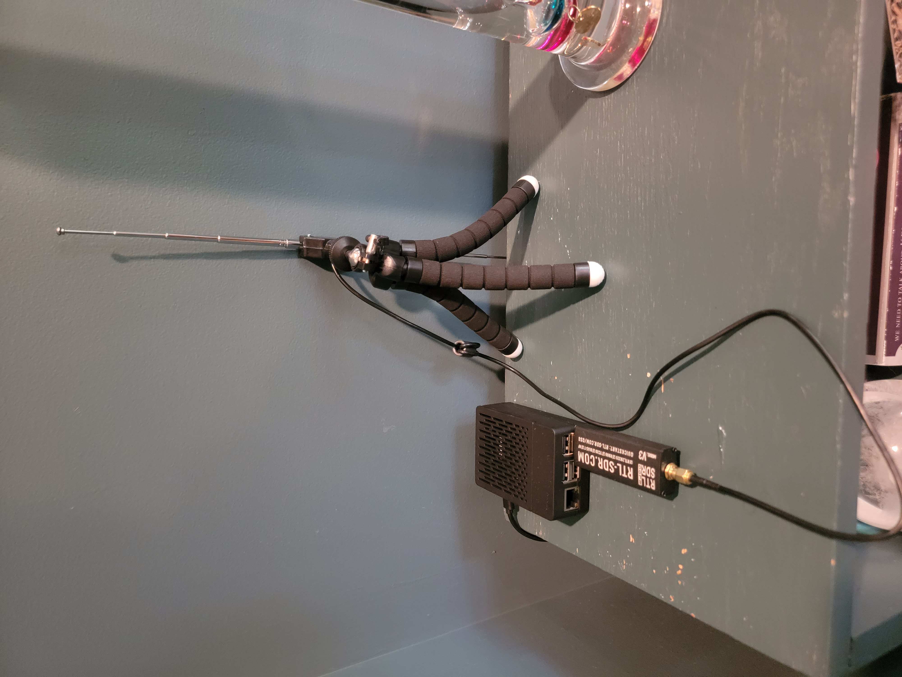
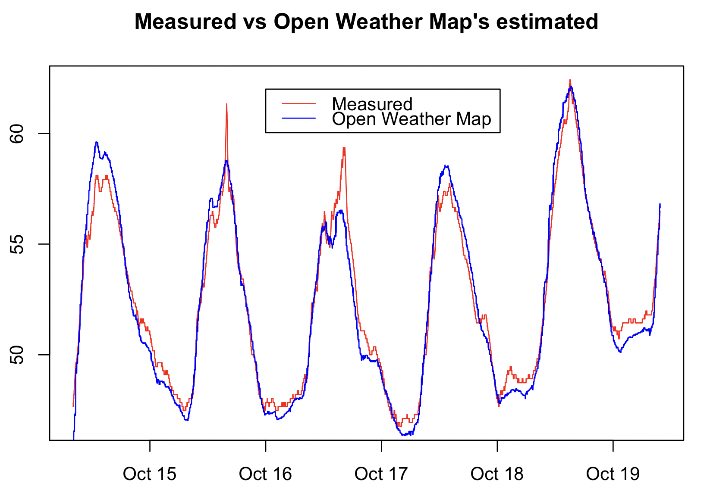
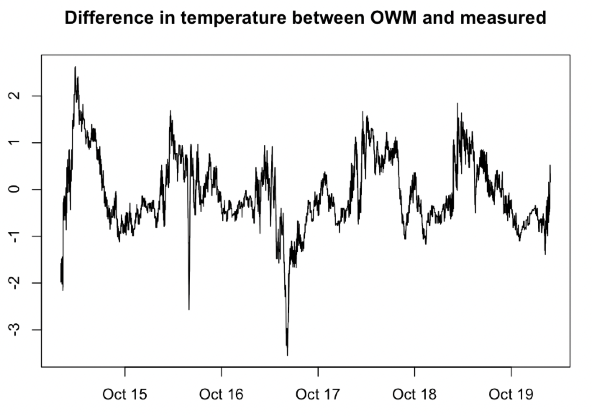
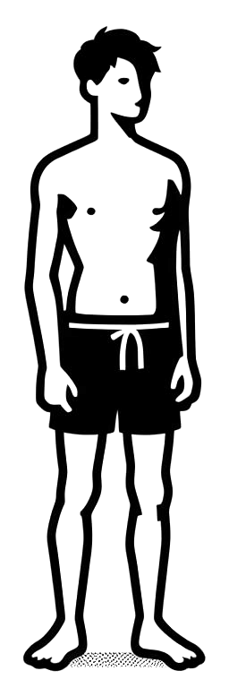
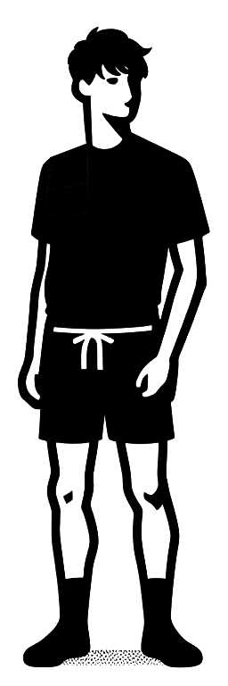
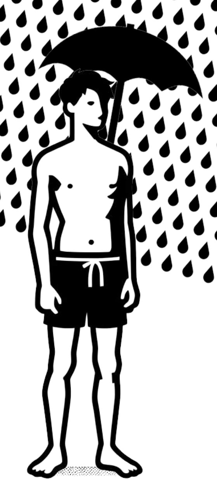

# Invisible Computers E-Paper weather display

This is a weather display for the [invisible computers](https://www.invisible-computers.com/) E-Paper smart screen, inspired by [E-ink is so Retropunk](https://rmkit.dev/eink-is-so-retropunk/) and [ESP32 e-paper weather display](https://github.com/lmarzen/esp32-weather-epd).

    
    

The filled grey areas in the graph are probability of precipitation.  The
vertical bar with the darker background is 3pm to 4pm, when the kids walk home
from the school bus.  The number is the current temperature.  The two clothing icons are
what to wear now, and what to wear between 3pm and 4pm.  If they're the same, or
it's after 3pm, there's only one icon.

## Why another e-paper weather display?

The same reason you might cook your own food, or assemble your own PC: you can customize it exactly how you want.

The dashboard is near our closet, and mostly designed to be looked at when you're heading outside.
I need to know whether to wear a parka, jacket,
raincoat, or just my shirt.  I'm also curious whether it will be warm enough
later to sit outside and work from the porch, and if so, whether it will be
cloudy, rainy or sunny.

And that's about it.  I don't care about wind or humidity or barometric pressure or UV index or dew point, and on the rare days
when I do, I can just pull out my phone and look at my app.

Aesthetically, I wanted a simple display that contained just the information I
desired and nothing else.

Growing up, my father han a LaCrosse weather station that featured an image of a
boy (WS-9611U-IT) or worman (WS-9760U-IT) dressed for the current weather, and I
liked it so much I got one a few years ago for our house.  The problem is, it was just based on
the current temperature, so if it was cold and clear in the morning, but hot or
rainy in the afternoon, it wouldn't tell you to wear a t-shirt under your jacket
or bring an umbrella.  So I wanted a clothing icon that would take into account
what the kids needed when walking home from the school bus in the afternoon.

Once I had it up and running, there was one other thing I kept wishing to see:
the forecast for the next week.  And with that, I've been quite happy with the
result, and have noticed other people in our household consulting it too.

## The Hardware

While I studied two years of electronics in High School in the 1980s (go 7400 series TTL!) and I'm handy with a soldering iron, I was happy to use an existing display and focus on software.  [Invisible Computers](https://www.invisible-computers.com/) fit the bill perfectly.  It's a 7.5" 800 x 480 black and white (not greyscale) display, without interaction, and reasonably priced.  Plus, Konstantin at Invisible Computers has been very helpful answering my questions.

My weather app doesn't run on the display itself.  Instead, I run it on a web
server on an old Raspberry Pi 3 in my home, and a Google Cloud instance queries
it once a minute, then forwards the image to the display.

## OpenWeatherMap API

I use and recommend OpenWeatherMap's API for this project.  Actually, the graph
data comes from weather.gov since I originally decided on that API.  But if I
were starting over, I'd just use OpenWeatherMap for everything.  See the
Epilogue (below) for details.

You can make 1,000 calls a day to their new v. 3.0 "One Call" API.  Since there are 1,440
minutes in a day, I implemented some simple caching: if it's been less than 5
minutes since last querying, return the previous result.  However, you can call the "Current
Weather" API as often as you want for free, so I call that on every refresh, about once a minute.

Sign up here to get an API key; it's free. <https://openweathermap.org/api>

You then have to subscribe for the "One Call" API, including giving a credit card.  However, you can put a hard limit of 1,000 calls on your account to ensure you are never charged:

   - Go to <https://home.openweathermap.org/subscriptions/billing_info/onecall_30/base?key=base&service=onecall_30>
   - Follow the instructions to complete the subscription.
   - Go to <https://home.openweathermap.org/subscriptions> and set the "Calls per day (no more than)" to 1,000. This ensures you will never overrun the free calls.

## Intercepting a Temperature Sensor: a 433 MHz detour

Perhaps the most important item in the entire display is the current
temperature, and it would be nice if I could get the actual temperature from
just outside my house, rather than something interpolated from various weather
stations that are all miles away.  And as I mentioned, I have a LaCrosse weather
station which has just such a sensor.  Does the wireless format use some
proprietary format?  Has it been reverse engineered?  Yes!

[rtl-sdr.com](https://rtl-sdr.com) sells a cheap USB dongle that can be used to intercept all kinds of
radio signals.  I bought the version 3, and followed the [quick
start](https://www.rtl-sdr.com/QSG) and
[antenna](https://www.rtl-sdr.com/using-our-new-dipole-antenna-kit/) guides.

I had an old Raspberry Pi 3 that I won when I worked at Facebook, for being
first in the Hacktober contest.  (In future years, I decided to focus on my work
rather than winning internal contests, no matter how fun.)  Anyway, in trying to
set up the Pi, I somehow managed to
destroy a 64 GB microSSD card, but got it work with another.  I downloaded,
compiled and configured the driver using the instructions from the "Getting
Started On Linux" section of the quick start guide.  To verify it was working, I
installed GQRX (`sudo apt-get install gqrx-sdr`) and could actually listen to FM
radio on my Raspberry Pi.

The last step was to install and run [`rtl_433`](https://github.com/merbanan/rtl_433).
Every 50 seconds, it would print the temperature and humidity from my outdoor
weather sensor!

    

That's the Raspberry Pi 3, RTL-SDR v3 dongle, and antenna.  The brains of the operation.

So now that we know the actual temperature, how accurate is OpenWeatherMap's
"current temperature"?

    
    

They're generally within one degree Fahrenheit, although occasionally differ by
up to about 3 degrees.  That's close enough for most people, although I've
gone to the effort of getting the temperature sensor working, so I'll leave that.
But my code, if it doesn't find the `rtl_433` executable, falls back on the
API's idea of current temperature.

## The Script

A simple Python script ties everything together.  It runs the webserver, runs a
separate thread which spawns `rtl_433` and consumes its output, queries the
weather APIs with caching, and uses Pillow to draw everything in an image.

The four non-rain clothing icons were generated by Bing's Dall-E integration.
My son was nice enough to add the rain and umbrella.

    
    
    
    

    
    
    

The weather icons are from <https://uifresh.net/product/weather-icons/>.

## Epilogue: weather.gov vs OpenWeatherMap

For weather API, I originally started with weather.gov.  The last time I looked
into this stuff, in the 1990s, weather forcasting used some of the biggest
supercomputers on the planet to do a kind of discrete element simulation of the atmosphere of the entire Earth, that
took 12 hours to run.  This stuff is only available to governments, so I assumed
everybody else was just taking the government's forecast and making it pretty, and I'd rather
get it from the original source.

This worked well except for a couple things.  When going outside, I want to know
the actual temperature now, and whether or not it is actually raining right now.
Weather.gov doesn't provide that.  The closest it comes is showing you data from
the closest weather station.  In my case, this is about 5 miles away.  But more
of a problem is, it only provides data once an hour, so the reported "current"
temperature can be up to an hour old.  When the temperature changes by 10
degrees F an hour, that can be the difference between "I definitely want a
jacket" and "It's too hot for a jacket."

As an aside: it's 2023.  Why are we only getting the current temperature once an
hour?  Like it's still the 1800s and someone needs to look at the level of
mercury in a thermometer and write it in a log book or something.  I suspect
that once an hour was practical when electronic thermometers were new, and since
then, "that's the way we've always done it."

Another problem is, I wanted to have a weather icon showing at least
precipitation and cloud cover.  But weather.gov doesn't have cloud cover in
their cleaned up API, only in their raw one, and it would have been more work to
dig it out.  It does provide a way to get a short and long description of the
weather, but both appear to be human generated and aren't easy to map to an
icon.

So I used OpenWeatherMap's API for the weather and clothing icons.  I didn't go
back and convert the old code, so it still uses a mix of the two.  If I were
starting the project from scratch, I would use the OpenWeatherMap API for
everything.
